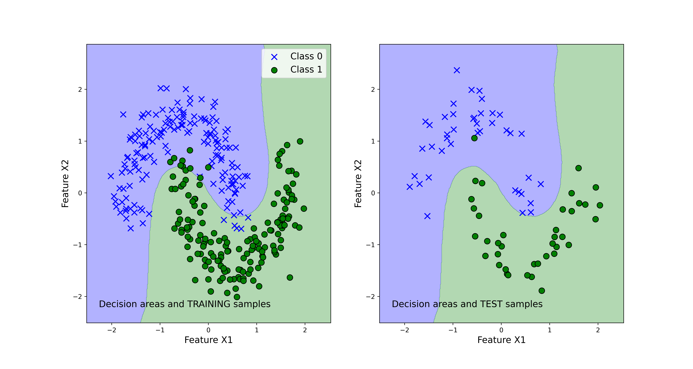

# Bagging-Classifier-in-Python
In this repository, we posted the codes that demonstrate how to implement the Bagging classifier in the Scikit-learn library and Python. The word bagging is forged by combining the word "bootstrapping" and "aggregating" The webpage explaining the posted codes is given here:

https://aleksandarhaber.com/bagging-ensemble-machine-learning-in-python-and-scikit-learn/

Explanation of the posted files:

- "bagging_implementation.py" - this is the main file that implments the bagging classifier
- "functions.py"  - this file implements a function for visualizing the classification results
- "classification_results_Bagging_SVM.png" - is an example of a figure generated by the posted codes that shows the classification regions. The figure is given below.

